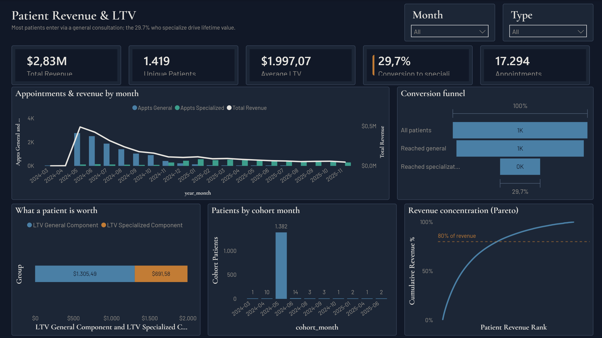

# Patient Revenue & LTV Analysis

A SQL-centric analysis of a clinical patient dataset — revenue, appointment mix, and
patient lifetime value — delivered as a scrollable data-story and a Power BI report.

**Live data-story:** https://erickgarciaoh.github.io/patient-revenue-ltv-analysis/

## The business question

1,419 patients, 17,294 appointments, 20 months. Every patient starts with a general
consultation (Type 1); some go on to a specialization (Type 2). The central question:
**how many make that leap, and what is it worth?**

Only 29.7% convert from general to specialized care. That conversion is the real
revenue engine — average LTV of $1,997.07 per patient splits into a general-consultation
base ($1,305.49) and a specialization component ($691.58) captured only by the
converting minority.

## What's in the repo

| Layer | Where | What it does |
|---|---|---|
| Ingestion | [src/01–03](src/) | Raw CSV → SQL Server `raw` table (everything `NVARCHAR`), loaded via a bulk-insert stored procedure |
| Transformation | [src/04–05](src/) | Casts/cleans raw data into a light star schema: `fact_appointment` + `dim_patient`, `dim_date`, `dim_appointment_type` |
| Analysis | [src/06–12](src/) | One SQL view per story in an `analysis` schema — monthly summary, conversion funnel, LTV waterfall, cohort retention, revenue Pareto, target-patient drill-downs |
| Consumption (primary) | [docs/](docs/) | Static HTML/JS data-story (Apache ECharts, no build step), fed by JSON exports of the `analysis` views — hosted on GitHub Pages straight from this folder |
| Consumption (additive) | [powerbi/](powerbi/) | PBIP-format semantic model + DAX measures + one-page report, same `analysis` views as source |

Full phase-by-phase build log and data-cleaning decisions are in [CLAUDE.md](CLAUDE.md).

## Key findings

- **Conversion is the bottleneck, not acquisition.** 95% of patients reach a first
  general consultation; only 30% ever reach a specialization.
- **LTV decomposes cleanly into volume × price**, on each service line — making the
  drivers of the $1,997 average LTV explicit and actionable, not just a single number.
- **Acquisition was a one-off spike, not a funnel.** 1,382 of 1,419 patients (97%) have
  their first visit in a single month (May 2024); retention on that cohort drops below
  25% by month six.
- **Revenue concentration is milder than the 80/20 cliché.** The top 20% of patients
  hold 61% of revenue; reaching 80% takes the top 38%.
- **The original "$50 fixed intake" premise doesn't hold.** Both appointment types have
  variable pricing; only ~0.8% of Type 1 visits are exactly $50.

## Data caveats

- The dataset's origin is unknown. The Type 1 = general / Type 2 = specialization
  interpretation is a **stated analyst assumption**, not a verified fact — treated as a
  working hypothesis throughout, not ground truth.
- Data quality was checked before analysis (nulls, duplicate keys, value ranges, date
  parseability) — see the data-story footer and [CLAUDE.md](CLAUDE.md) for the full
  ruleset.
- The Dec-2026 projection in the data-story is a **planning ceiling**, not a forecast:
  it assumes constant per-patient cadence and zero churn.

## Stack

SQL Server (T-SQL) for the entire pipeline · Apache ECharts + vanilla JS for the
data-story · Power BI (PBIP/TMDL) + DAX for the additive BI layer · git for version
control.

## Running it locally

The data-story is fully static — open [docs/index.html](docs/index.html) in a browser,
or serve `docs/` with any static file server. The Power BI report opens in Power BI
Desktop from [powerbi/patient_revenue_ltv.pbip](powerbi/patient_revenue_ltv.pbip); the
semantic model expects the same SQL Server instance the `src/` scripts build against.
